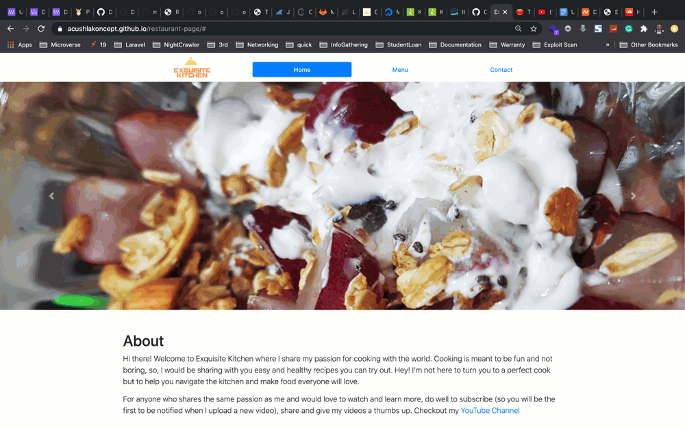

<<<<<<< HEAD
# Buggy Restaurant

This a Simple Restuarant Page App using webpack to manipulate DOM by dynamically rendering its various pages: Home, Menu, and Contact. 

Below you can see how this website should look and behave:



## Why this Restaurant page is special?

Buggy Restaurant is unique as it will serve you not only delicious food but also a couple of bugs 🐛🐛.
This project is supposed to be used in the "Catch hidden bugs" exercise.

## Setup

### Clone this repository

```bash
$ git clone git@github.com:microverseinc/curriculum-tools-buggy-restaurant.git
$ cd curriculum-tools-buggy-restaurant
```

### Run project

```bash
$ npm install
$ npm run start # this will make webpack watching for your changes in code
```

### Open page in browser
```bash
$ open dist/index.html
```


## Built With

- HTML
- JavaScript
- BootStrap


## Author

The author of the entire code is Uduak Essien - [acushlakoncept](https://github.com/acushlakoncept).

## Acknowledgements

Thank you [acushlakoncept](https://github.com/acushlakoncept) for preparing this code - in its perfect and also bugged version! 👏👏👏
=======
# curriculum-tools-buggy-restaurant
demo repository made to find bugs using git stash and good and bad commit 
>>>>>>> e98126db020f654a9ddc7348070572233413e9b8
